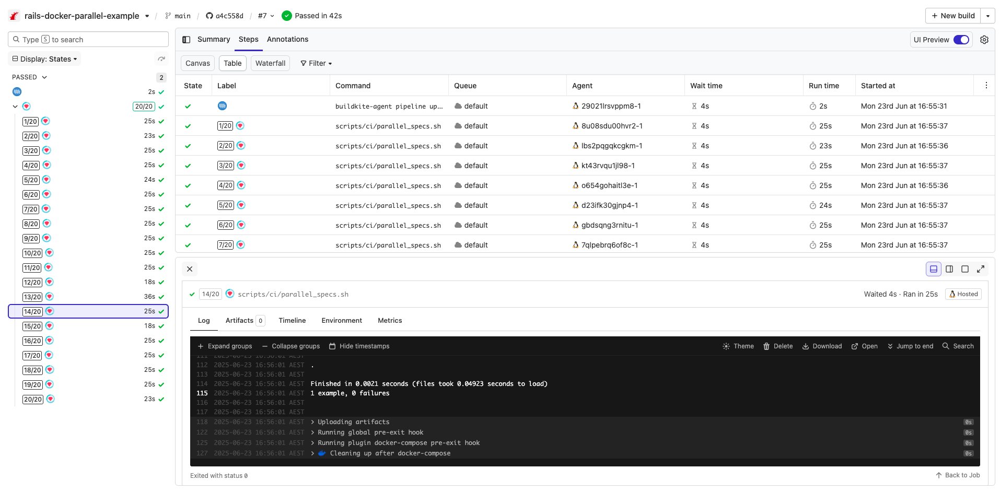

# Buildkite Rails Docker Parallel Pipeline Example

[](https://buildkite.com/buildkite/rails-docker-parallel-example/builds/latest?branch=main)
[](https://buildkite.com/new)

This repository is an example [Buildkite](https://buildkite.com/) pipeline that demonstrates how to run a large number of parallel test jobs for a [Rails](https://rubyonrails.org/) application using [Docker](https://www.docker.com/) and [Knapsack](https://github.com/ArturT/knapsack).

👉 **See this example in action:** [buildkite/rails-docker-parallel-example](https://buildkite.com/buildkite/rails-docker-parallel-example/builds/latest?branch=main)

[](https://buildkite.com/new)

<a href="https://buildkite.com/buildkite/rails-docker-parallel-example/builds/latest?branch=main">
  
</a>

<!-- docs:start -->

## How it works
In the [pipeline configuration file](.buildkite/pipeline.yml) the `parallelism` property for the test step is set to 20. When a build, the step will appear 20 times in the pipeline, each with different environment variables exposed so you can divvy up your test suite accordingly. You can set the parallelism as high as you need to bring down your build times.

This example:
- Uses Docker Compose to orchestrate the environment (Redis, Postgres, Memcached)
- Runs tests in parallel across 20 containers using Buildkite’s `parallelism` feature
- Leverages [Knapsack](https://github.com/ArturT/knapsack) for even test distribution
- Is suitable for use with autoscaling environments like the [Buildkite AWS Stack](https://github.com/buildkite/elastic-ci-stack-for-aws)

Key files:
- [`docker-compose.yml`](docker-compose.yml): defines app services
- [`Dockerfile`](Dockerfile): sets up the Ruby environment and database waiters
- [`pipeline.yml`](.buildkite/pipeline.yml): configures a parallel test step
- [`scripts/ci/parallel_specs.sh`](scripts/ci/parallel_specs.sh): runs specs in parallel

### Parallel test execution

In [`pipeline.yml`](.buildkite/pipeline.yml), the test step is configured with:

```yaml
parallelism: 20
```

This causes the step to run 20 times in parallel. Each instance is exposed to environment variables like `BUILDKITE_PARALLEL_JOB` and `BUILDKITE_PARALLEL_JOB_COUNT`, which can be used to split the test suite dynamically.

## Alternate setups

> 💡 Not using Docker? Try the [Rails Parallel Example](https://github.com/buildkite/rails-parallel-example)

> 💡 Want dynamic splitting/allocation? See the [Knapsack Pro version](https://github.com/KnapsackPro/buildkite-rails-docker-parallel-example-with-knapsack_pro)


## Further Reading

See the [parallelizing builds guide](https://buildkite.com/docs/guides/parallelizing-builds) for more information to create parallelized and distributed builds with Buildkite.

See the [Containerized Builds with Docker guide](https://buildkite.com/docs/guides/docker-containerized-builds) for information on how to use Docker Compose with Buildkite pipelines.

Consult the [Knapsack documentation](https://github.com/ArturT/knapsack) for configuring your database and dependent services to support running parallel steps on the one machine.

<!-- docs:end -->

## License

See [LICENSE.md](LICENSE.md) (MIT)
